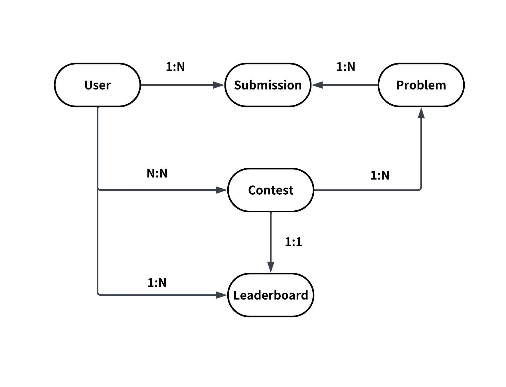

# Design Leetcode

Members: Tuan Le Hoang - Hoang Long Le

---

# Agenda

1. Clarify Requirements
2. Back of the Envelope Estimation
3. API Design
4. Data Model Design
5. High-Level Design
6. Discussion

---

# 1. Clarify Requirements

---

# Functional Requirements

- View Problems
- Submit Solutions in multiple languages
- Join Coding Contests

---

# Non-Functional Requirements

- Availability: 99.9% uptime
- Scalability: 10K+ concurrent submissions
- Latency: Code execution < 10s, leaderboard update: < 5s
- Security: Isolated code execution, prevent malicious code

---

# Out of Scope

- Solution discussion
- User Authentication
- Payment processing
- User analytics / User management

---

# 2. Back of the Envelope Estimation

- Leetcode has [26.3 milion](https://en.wikipedia.org/wiki/LeetCode) monthly visitors
  => 26.3 \* 10^6 / 30 / 86000 = 10 QPS
- Daily Active Users: 500,000
- Contest participants: 10,000
- Problems in DB: 3000+, growth: 8 problems/week => 418 problems/year

- Support 10+ popular programming Languages: Python 3, python 2, Java, C++, C, C#, C, Javascript, Typescript, Go, Swift, Rust, PHP, Kotlin...

---

# Submission Estimation

```
Daily submissions:
    500,000 DAU * 3 = 1.5 M submissions/day
    => 1.5 * 10^6 / 86,000 = 17 submissions/second
    => 2 submissions/language/second


Peak submissions (contest):
    10,000 * 20 submissions = 200,000 in 90 minutes
    => 2 * 10^5 / 5400 = 37 submissions/second
    => 4 submissions/language/second
```

---

# Storage Estimation

```
Per submission:
    Code: ~10 KB
    Metadata: ~1KB
    Results: ~2 KB
    => Total: ~13 KB
    => Daily storage: 1.5 M * 13 KB = 20 GB/day
    => Monthly storage growth: 600 GB/month

Problems + Test cases:
    3000*50 KB + 3,000 * 50 test cases * 10 KB ≈ 1.6 GB
```

---

# Bandwidth Estimation

```
Incoming (submissions):
    1.5 M * 10 KB = 15 GB/day

Outgoing
    Problem views: 10 M * 50 KB = 500 GB/day
    Results: 1.5 M * 5KB = 7.5 GB/day

=> Total: ~520 GB/day ≈ 6 MB/s average

```

---

# 3. API Design

---

# Problem APIs

```http
GET /problems?page=1&limit=100
-> Partial<Problem>[] : [{id, title, difficulty, tags...}]

GET /problems/{problem_id}
-> {id, title, description, examples, constraints, starter_code, difficulty, tags, acceptance_rate...}
```

---

# Submission APIs

```http
POST /problems/{problem_id}/run
Body: {code, language, test_input}
-> {results, runtime_ms, memory_bk}

POST /problems/{problems_id}/submit
Body: {code, language}
-> {submission_id}

GET /submissions/{submission_id}
-> {status: "pending" | "running" | "accepted" | "wrong_anser" ..., results, runtime_ms, memory_kb}
```

---

# Contest APIs

```http
GET /contests
-> {upcoming: [...], ongoing: [...], past: [...]}

GET /contests/{contest_id}
-> {id, title, start_time, end_time, problems: [...]}

POST /contests/{contest_id}/register
-> {success: true}

GET /contests/{contest_id}/leaderboard?page=1&limit=50
{rankings: [{rank, user, score, finish_time}]}

```

---

# 4. Data Model Design

---

## Entity Relationship Diagram



---

## Data Models

```prisma
model User {
  id         Uuid
  username   String
  email      String
  submissions Submission[]
  contestEntries ContestEntry[]
}

model Problem {
  id          Uuid
  title       String
  description String
  difficulty  String   // easy | medium | hard
  testCases   TestCase[]
  submissions Submission[]
  contests    Contest[] @relation("ContestProblems")
}

```

---

## Data Models (cont.)

```prisma
model Submission {
  id        Uuid
  userId    Uuid
  problemId Uuid
  code      String
  language  String
  status    Enum   // pending | accepted | wrong_answer | TLE | MLE | RE | CE
  runtimeMs Int?
  memoryKb  Int?
  user      User     @relation(fields: [userId], references: [id])
  problem   Problem  @relation(fields: [problemId], references: [id])
}

model Contest {
  id        Uuid
  title     String
  startTime DateTime
  endTime   DateTime
  problems  Problem[] @relation("ContestProblems")
  entries   ContestEntry[]
  leaderboard Leaderboard?
}
```

---

## Data Models (cont.)

```prisma
model ContestEntry {
  id        Uuid
  contestId Uuid
  userId    Uuid
  score     Int     @default(0)
  finishTime Int    @default(0)
  contest   Contest @relation(fields: [contestId], references: [id])
  user      User    @relation(fields: [userId], references: [id])
  @@unique([contestId, userId])
}

model Leaderboard {
  id        Uuid
  contestId Uuid  @unique
  contest   Contest @relation(fields: [contestId], references: [id])
  // Rankings stored in Redis: ZSET contest:{id}:leaderboard
}
```

---

# 5. High Level Design

---


---

# Detailed design : Flow

---

## View Problems

1. Client sends `GET /problems` or `GET /problems/{id}` to Primary Server
2. Server queries SQL DB for problem data
3. Returns problem list or details to client

---

## Submit Solutions

1. Client sends `POST /submission` with code and language
2. Primary Server pushes submission to **Queue** (async processing)
3. **Worker** pulls from queue, executes code in **Docker Container**
4. Worker sends results back to Primary Server
5. Server stores results in SQL DB and returns to client via polling `GET /submissions/{id}`

---

## Join Coding Contests

1. Client polls `GET /leaderboard` every 5 seconds
2. Primary Server fetches rankings from **Redis Sorted Set** (fast O(log N))
3. On submission completion, Worker updates both SQL DB and Redis cache
4. Returns real-time leaderboard to client

---

# 6. Discussion

---

## Q1: How to ensure isolation and security when running user code?

**Solution: Docker Containers with Security Configurations**

- **Read-Only Filesystem**: Mount code directory as read-only, use temp directory for output
- **CPU & Memory Limits**: Kill container if limits exceeded, prevent resource exhaustion
- **Explicit Timeout**: 5-second limit to prevent infinite loops
- **Network Isolation**: Disable network access using VPC Security Groups/NACLs
- **Seccomp (SEcure COMputing mode)**: Restrict system calls to prevent host compromise

---

## Q2: How to make leaderboard fetching more efficient?

**Solution: Redis Sorted Sets + Polling**

- Store leaderboard in Redis sorted set: `competition:leaderboard:{contestId}`
- Score = (user's total score, solve time), Value = userId
- Update Redis on each submission: `ZADD competition:leaderboard:{contestId} {score} {userId}`
- Retrieve top N users: `ZREVRANGE ... 0 N-1 WITHSCORES` (O(log N))
- Client polls every 5 seconds - simpler than WebSockets, acceptable latency
- Reduces database load significantly

---

## Q3: How to scale for 10K+ concurrent users during contests?

**Solution: Queue-based Horizontal Scaling**

- Add **message queue** (SQS) between API server and workers
- Buffer submissions during peak times, prevent container overload
- Workers pull and process submissions independently
- **Async flow**: API returns immediately with `submission_id`
- Client polls `GET /submissions/{id}` every second for results
- Enables retries on container failures

---

## Q4: How to handle running test cases across multiple languages?

**Solution: Standardized Serialization + Language-Specific Test Harness**

- Write **one set of test cases per problem** (language-agnostic)
- Serialize inputs/outputs in standard format (e.g., JSON arrays for trees)
- Each language has a **test harness** that:
  - Deserializes standardized input
  - Passes to user's code
  - Compares output with expected result

---

# References

- [Hello Interview - Design LeetCode](https://www.hellointerview.com/learn/system-design/answer-keys/leetcode)

- [System Design School - Design LeetCode](https://systemdesignschool.io/problems/leetcode/solution)

---

<style scoped>
    h1 {
        text-align: center;
        margin-top: 40%;
    }
</style>

# Thank you
